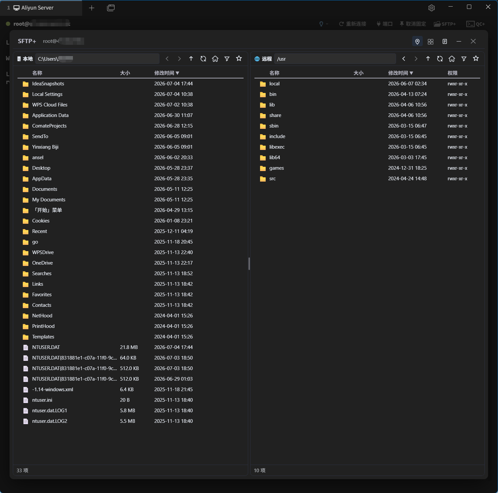
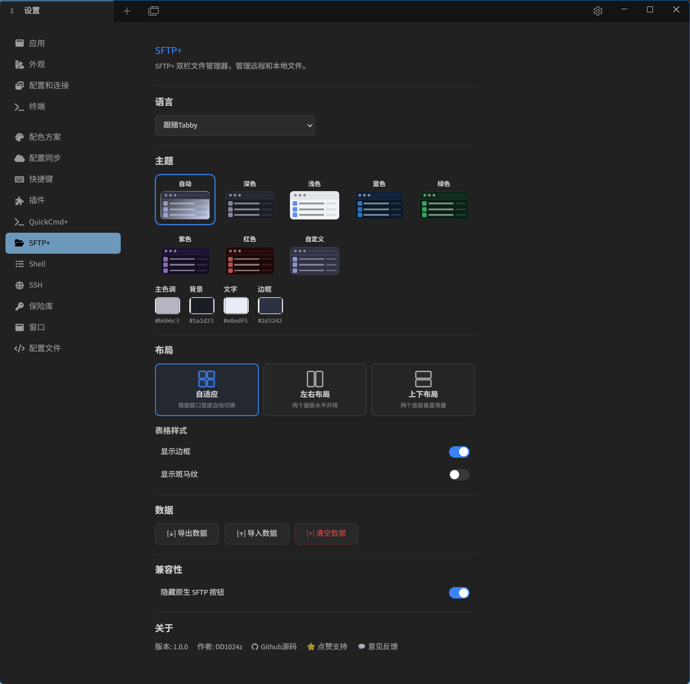

# SFTP+ — Dual-Pane SFTP File Manager for Tabby

| [中文](https://github.com/10D24D/Tabby-SFTP-Plus/blob/main/README.md) | [English](https://github.com/10D24D/Tabby-SFTP-Plus/blob/main/README.en.md) |

[](https://github.com/10D24D/Tabby-SFTP-Plus)
[](https://github.com/10D24D/Tabby-SFTP-Plus/stargazers)
[](https://github.com/10D24D/Tabby-SFTP-Plus)

SFTP+ is a plugin for [Tabby Terminal](https://tabby.sh/) that adds a **dual-pane SFTP file manager** right inside your SSH terminal tabs. Features include **drag-and-drop transfers**, **bookmark system**, **path memory**, transfer logs, file conflict handling, permission editing, and more — all without leaving the terminal.

---

## 📋 Features at a Glance

| Category | Description |
|----------|-------------|
| **📂 Dual-Pane Manager** | Local (left) + Remote (right); horizontal / vertical / adaptive / single-pane layouts; draggable splitter, double-click to reset |
| **👁️ View / Edit** | Built-in text/image viewer and text editor (local + remote); image navigation (prev/next in same directory); copy / copy selection; view-as-text; open or edit in system default app |
| **🔄 Drag & Drop** | Drag across panes to upload/download; recursive folder transfer; drag from OS Explorer/Desktop into either pane |
| **⬆️ Context Transfer** | Right-click upload on local pane, download on remote pane (multi-select batch) |
| **⚡ High-Speed Transfer** | Intra-directory file-level parallelism (1-10 concurrent, adjustable); tar channel for massive small-file directories (pack → single-file transfer → unpack); batch delete via SSH `rm -rf` / `fs.rm(recursive)` |
| **🔖 Bookmark System** | Global bookmarks (visible across all connections) + connection bookmarks (per SSH session); drag-to-reorder |
| **📋 Transfer Log** | Full operation history including **Edit Load** / **Edit Save** types; filtering, stats, JSON export |
| **⚡ Transfer Control** | Progress bars (with percentage), pause/resume/cancel, resume support, real-time speed |
| **⚠️ File Conflict** | Visual diff on conflict (shows upload⬆/download⬇ direction), with overwrite/skip/rename options and batch processing; merge-overwrite has its own progress panel |
| **🔐 Permission Editor** | Remote chmod via 3×3 checkbox matrix with octal preview |
| **📌 Context Menus** | Upload/download, view/edit, new/rename/delete, copy/cut/paste, refresh, select all/invert; <br />Header: column visibility, fit widths, borders & zebra stripes |
| **🔍 Filter & Sort** | Keyword filter, multi-column sorting (click headers), configurable visible columns |
| **🧭 Path Mode** | Three modes: `off` / `remember` / `sync` (sync with terminal); configurable default |
| **🎨 Theme System** | 7 presets + custom colors, supports following the Tabby system theme |
| **⌨️ Panel Hotkey** | Customizable panel toggle hotkey with record/clear/conflict detection |
| **🌐 Internationalization** | Chinese (Simplified) and English, auto-detects Tabby/browser language |
| **📦 Data Backup** | One-click export/import of all data (bookmarks, logs, settings, path memory) |

---

## 🖥️ Interface Guide

|  |  |
| :------------------------------------------: | :---------------------------------------------: |

### Interface Zones

| Zone | Description |
|------|-------------|
| **Title Bar** | Plugin name, current SSH connection info, layout toggle, transfer log entry, minimize/close |
| **Left / Right Panes** | Independent browsing with path input, navigation buttons, bookmarks, and filtering |
| **File List** | Displays files and directories; multi-column sort, draggable column widths, reorderable columns |
| **Bottom Action Bar** | Shows selection count & total size |
| **Transfer Queue** | Real-time upload/download progress, speed, ETA; supports pause/resume/cancel |
| **Bookmark Popup** | Grouped by "connection bookmarks" and "global bookmarks"; drag-to-reorder and quick jump |
| **Context Menu** | Right-click on files or table headers for full file operations and column configuration |
| **Transfer Log** | History popup with type filtering, success/failure filter, JSON export |

---

## 📥 Installation

1. Make sure [Tabby Terminal](https://tabby.sh/) is installed
2. Configure the plugin directory in Tabby settings
3. Place the built plugin (see "Development" section) into the plugin directory, then restart Tabby
4. Open any SSH terminal tab — the **SFTP+** button should appear in the toolbar

---

## 🚀 Quick Start

1. **Open** — Click the `SFTP+` button in the toolbar of an SSH terminal tab
2. **Browse** — Navigate local files on the left and remote SFTP directories on the right; double-click to enter a directory
3. **Transfer** — Drag across panes, or use right-click upload/download
4. **View/Edit** — Right-click text or image files to view in-app; edit text and save (remote files upload automatically)

---

## 📏 File Size Limits

| Operation | Limit |
|-----------|-------|
| Text view | 2 MB |
| Image view | 15 MB |
| Text edit | 5 MB |

Exceeding a limit shows a clear dialog and toast with the cap.

---

## ⚙️ Settings Panel

Navigate to Tabby Settings → "SFTP+" in the left sidebar:

| Setting | Description |
|---------|-------------|
| **Language** | Follow System / Chinese / English |
| **Theme** | Auto / Dark / Light / Blue / Green / Purple / Red / Custom |
| **Custom Colors** | Independently set primary, background, text, and border colors |
| **Layout** | Adaptive (auto-switches based on panel width) / Horizontal / Vertical |
| **Table Style** | Show borders, show zebra stripes |
| **Upload/Download Concurrency** | Intra-directory file-level concurrency (1-10), takes effect immediately |
| **Fast Mode** | Skip pre-scan and start transfer immediately (no percentage, byte progress only) |
| **Default Path Mode** | Path mode for new connections on first open (off / remember / sync) |
| **Default Show Hidden** | Whether to show hidden files on new connections |
| **Toolbar Customization** | Drag-to-reorder toolbar buttons, hide unused items |
| **Panel Hotkey** | Custom panel toggle hotkey |
| **Data Backup** | Export/import all data (JSON); clear all data (requires typing `DELETE` to confirm) |
| **Compatibility** | Hide the native Tabby SFTP button to avoid conflicts |

---

## 💾 Data Backup

All data (bookmarks, transfer logs, path memory, settings) can be exported to or imported from a single JSON file.

Path: Settings → Data Backup → Export / Import

---

## 📜 Changelog

Latest: **v2.0.2** (2026-08-22) — [Full changelog](CHANGELOG.md)

---

## 🛠️ Development

### Tech Stack

| Category | Technology |
|----------|-----------|
| Framework | Angular 9 |
| Language | TypeScript 5.8 |
| Build | Webpack 5 |
| Styling | Inline styles (CSS variables for adaptive theming) |
| Dependencies | `tabby-core` / `tabby-settings` / `tabby-terminal` |
| Protocol | SFTP (reuses Tabby SSH Session) |

### Build

```bash
# Install dependencies
npm install

# Development mode (watch mode)
npm run watch

# Production build
npm run build
```

The built plugin bundle is in `dist/` (`index.js` + auto-generated `package.json`).

### Project Structure

```
tabby-FTPS+/
├── docs/
├── scripts/                       # Build helpers (copy-sftp-manifest generates dist/package.json)
├── src/
│   ├── index.ts
│   ├── tabby-shims.d.ts
│   ├── services/                  # sftp.service / bookmarks / i18n / transfer-log / config (Tabby convention)
│   ├── settings/                  # sftp-settings component (Tabby convention)
│   ├── tabby/                     # Terminal integration: config/hotkey providers, terminal-decorator
│   ├── sftp/                      # SFTP feature module
│   │   ├── sftp-floating-panel.component.ts
│   │   ├── sftp-workspace-tab.component.ts
│   │   ├── components/            # View layer (V): file panes, dialogs, context menu, conflict, transfer queue…
│   │   ├── controllers/           # Controller layer (C): column / viewer / bookmark controllers
│   │   └── core/                  # Logic / utils / types: transfer, conflict, drop, clipboard, path…
│   └── tabby-plugin-common/       # Shared utilities across plugins (theme / utils)
├── dist/                                # Build output (index.js + package.json)
└── package.json
```

See [docs/DEVELOPMENT.md](docs/DEVELOPMENT.md) for the full tree.

---

## 🤝 How to Contribute

Contributions are always welcome! The plugin was conceived by the author (DD1024z), with the majority of implementation code generated using AI assistance.

- Report bugs or request features: [GitHub Issues](https://github.com/10D24D/Tabby-SFTP-Plus/issues) 📝
- Contribute code: Fork the project and submit a Pull Request 🚀
- Like SFTP+? Give it a [⭐ Star](https://github.com/10D24D/Tabby-SFTP-Plus) to show your support!

Your stars and support are what keep me developing — thank you! ❤️

## 🙏 Special Thanks

SFTP+ would not have grown without the foundational projects and the community's support. Special thanks to:

- [Tabby](https://tabby.sh/) — the powerful cross-platform terminal that hosts this plugin
- [SFTP (SSH File Transfer Protocol)](https://en.wikipedia.org/wiki/SSH_File_Transfer_Protocol) — the underlying file transfer protocol this plugin's remote file management is built upon
- [@fweiger](https://github.com/fweiger) — Issue #13: a detailed UX optimization report (click/double-click interaction, right-click menu ordering, hotkey focus, etc.); several points shipped in v2.0.2
- [@HarpyWar](https://github.com/HarpyWar) — Issue #3: reported a broken hotkey settings page; fixed
- [@xingkongxiademodeng](https://github.com/xingkongxiademodeng) — Issue #10: flagged the serial (non-concurrent) directory upload bottleneck, guiding the concurrency optimization
- [@Hanzo-Huang](https://github.com/Hanzo-Huang) — Issue #5: suggested "get current working directory" like native SFTP; implemented
- Thanks also to [@webbrain-one](https://github.com/webbrain-one) and [@JayceVane](https://github.com/JayceVane) for their Pull Request attempts

## 📝 License

SFTP+ is licensed under the [MIT](LICENSE) license. Feel free to use, modify, and share it — just comply with the terms.

## ⚠️ Disclaimer

SFTP+ is a free and open-source project, primarily built with AI-assisted generation, so bugs and defects are inevitable. The author cannot guarantee that all features and code have been thoroughly verified. By using this plugin, you agree to assume the associated risks. The developer shall not be held liable for any problems or losses arising from its use. Please use it at your own discretion.
